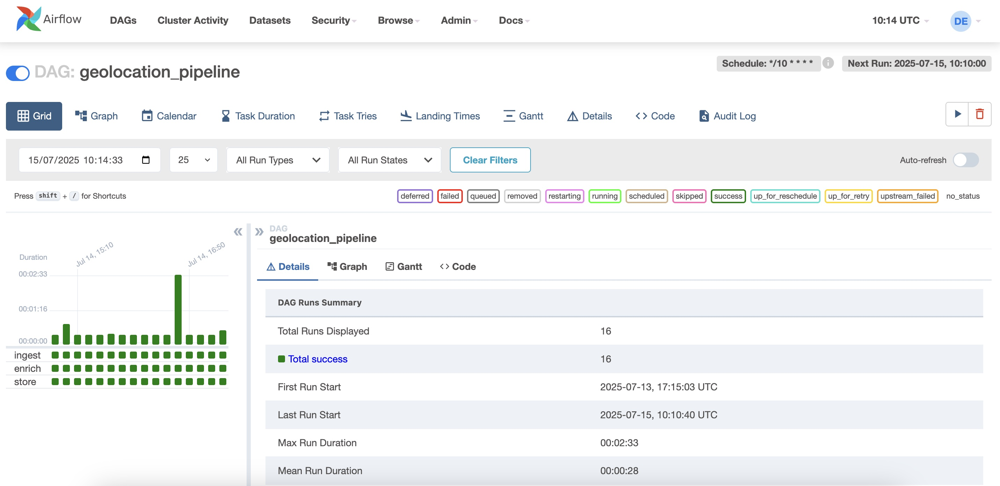
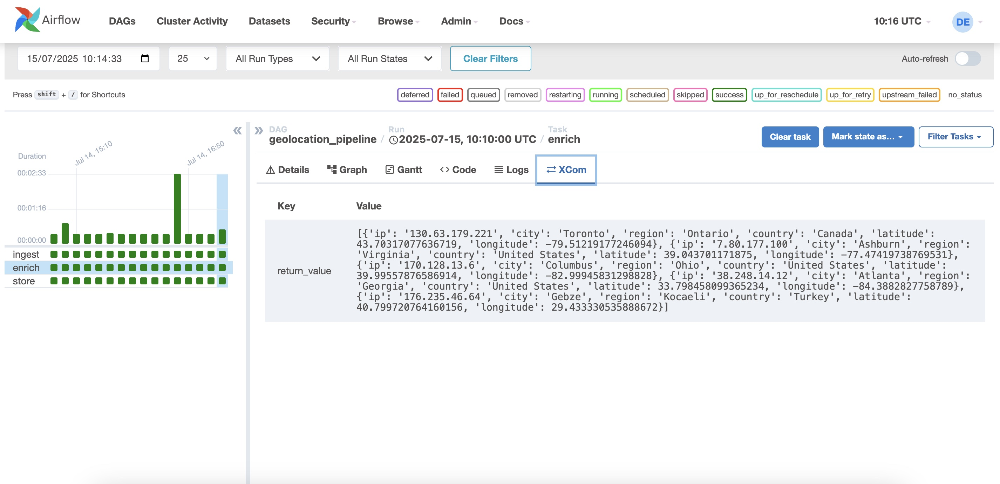
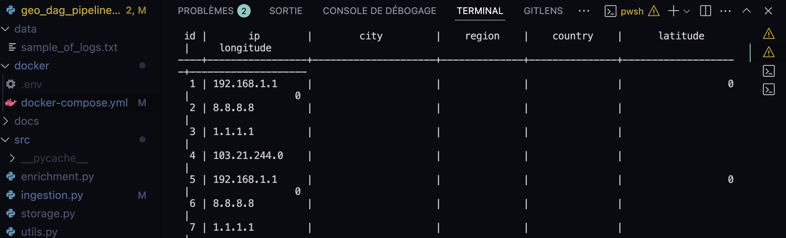

# 📍 Real-Time IP Geolocation Data Pipeline

This project builds a real-time data pipeline to ingest, enrich, and store IP geolocation data using:

-   **Apache Airflow** (DAG orchestration)
-   **PostgreSQL** (Storage)
-   **Docker Compose** (Containerisation)
-   **IPStack API** (IP enrichment)

## Features

-   Ingest data from a sample log file and simulate live data with randomly generated IPs.
-   Enrich IPs using the IPStack API.
-   Store enriched data in PostgreSQL.
-   Fully containerised using Docker.
-   Airflow DAG runs automatically every 10 minutes.

## 📁 Project Structure

```
geolocation_ip_app/
├── README.md
├── config
├── dags
│   └── geo_dag_pipeline.py
├── data
│   └── sample_of_logs.txt
├── docker
│   └── docker-compose.yml
├── docs
│   ├── airflow_dags_time.jpg
│   ├── airflow_output.jpg
│   ├── dags_workflow_graph.jpg
│   └── ip_geolocation_table.jpg
├── requirements.txt
├── src
│   ├── enrichment.py
│   ├── ingestion.py
│   ├── storage.py
│   └── utils.py
└── tests
```

## 📦 Clone the Repository

```bash
git clone https://github.com/konomissira/geolocation_ip_app.git
cd geolocation_ip_app
```

## ⚙️ Prerequisites

-   Python 3.9 or above
-   Docker & Docker Desktop
-   Free IPStack API Key

## 🔐 Environment Variables

This project uses **two `.env` files**:

1. `config/.env` — used by Airflow inside the DAG.
2. `docker/.env` — used by Docker Compose services.

Both files are ignored by Git to keep credentials safe (`.gitignore`).

You’ll need to create them manually like the following:

```env
# Inside config/.env
GEO_IP_API_KEY=API_KEY

POSTGRES_USER=postgres_user
POSTGRES_PASSWORD=postgres_password
POSTGRES_DB=postgres_database_name

# Database Credentials
DB_HOST=postgres
DB_PORT=5432
DB_NAME=database_name
DB_USER=database_username
DB_PASS=database_password
```

```env
# Inside docker/.env
POSTGRES_USER=postgres_username
POSTGRES_PASSWORD=postgres_password
POSTGRES_DB=postgres_database_name
```

## Set Up Virtual Environment

### macOS / Linux

```bash
python3 -m venv .venv
source .venv/bin/activate
pip install -r requirements.txt
```

### Windows

```bash
python -m venv .venv
.venv\Scripts\activate
pip install -r requirements.txt
```

## 🐳 Run the Project

```bash
# Build and start services
cd docker
docker compose up -d --build
```

### Create Airflow User (first-time only)

```bash
docker exec -it airflow_webserver airflow users create \
  --username airflow \
  --firstname Data \
  --lastname Engineer \
  --role Admin \
  --email airflow@example.com \
  --password airflow
```

Then access Airflow UI via: [http://localhost:8080](http://localhost:8080)  
Login: `airflow / airflow`

---

## ⏱️ DAG Overview

**DAG ID:** `geolocation_pipeline`  
**Schedule:** Every 10 minutes (`*/10 * * * *`)

### Tasks:

1. `ingest`: Generate random IPs.
2. `enrich`: Enrich IPs via IPStack.
3. `store`: Insert into PostgreSQL.

---

## Achievements

-   Built full pipeline with Airflow
-   Generated and enriched IP data
-   Connected to PostgreSQL
-   Automated the DAG
-   Solved Docker volume issues
-   Fully reproducible and containerised

## Future Roadmap

-   🌐 Accept IPs from web apps (log collector or queue)
-   🔔 Webhooks or REST APIs to receive real-time IPs
-   📦 Use Kafka, AWS Kinesis for log streams

## Troubleshooting Notes

One issue was making the file visible in the container (`sample_of_logs.txt`).  
Solution: map absolute path to `/opt/airflow/data` in Docker volumes.

## 📸 Screenshots

### Airflow DAG Running



### DAG Workflow Graph


### Airflow Task Output



### PostgreSQL Table View



## 📄 License

MIT License © 2025 Kono Missira

## 🔗 GitHub Repository

[👉 View on GitHub](https://github.com/konomissira/geolocation_ip_app.git)
