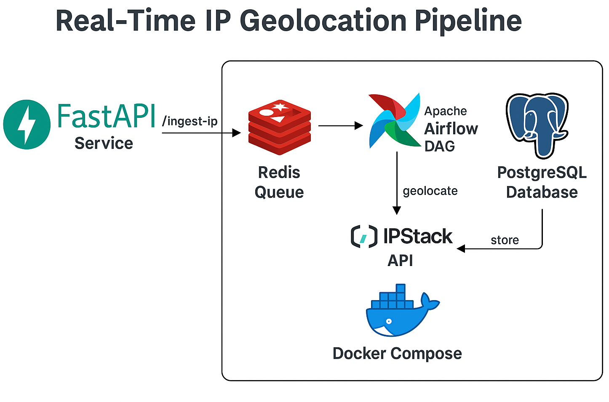

# 📍 Real-Time IP Geolocation Data Pipeline (Updated Version)

This project demonstrates an **event-driven real-time data pipeline** that ingests, enriches, and stores IP geolocation data using:

-   **FastAPI** (API for real-time IP ingestion)
-   **Redis** (Queue for decoupled processing)
-   **Apache Airflow** (Workflow orchestration)
-   **PostgreSQL** (Data storage)
-   **Docker Compose** (Containerisation)
-   **IPStack API** (IP enrichment)

## ✅ Why This Project Matters

Many companies need to track user IP locations for:

-   **Fraud detection** (flagging suspicious logins)
-   **Personalisation** (region-specific content)
-   **Security monitoring** (detect unusual access patterns)

This pipeline mimics real-world architectures used in **finance, e-commerce, and streaming platforms**.

---

## 🧠 Features

-   **FastAPI** endpoint to accept IPs in real-time.
-   **Redis queue** for decoupled ingestion.
-   **Airflow DAG** to orchestrate enrichment and storage.
-   **Enrich IPs** with city, country, latitude & longitude using IPStack API.
-   **Store results** in PostgreSQL for analytics.
-   Fully **Dockerised** for easy setup.

---

## 📁 Project Structure

```
geolocation_ip_app/
├── README.md
├── config/
├── dags/
│   ├── geo_dag_pipeline.py         # Original DAG (random IPs)
│   └── ip_dag_app.py              # NEW DAG (fetch from Redis queue)
├── data/
│   └── sample_of_logs.txt
├── docker/
│   ├── docker-compose.yml
│   └── Dockerfile.fastapi
├── docs/
│   ├── architecture_diagram.jpg
│   ├── airflow_dags_time.jpg
│   ├── airflow_output.jpg
│   ├── dags_workflow_graph.jpg
│   ├── demo_pipeline.gif
│   └── ip_geolocation_table.jpg
├── requirements.txt
├── src/
│   ├── ingestion.py               # Original ingestion (random IPs)
│   ├── ingestion_app.py           # NEW ingestion (fetch from Redis)
│   ├── api_service_app.py         # NEW FastAPI service
│   ├── enrichment.py
│   ├── storage.py
│   └── utils.py
└── tests/
```

---

## ✅ Updated Tech Stack

-   **FastAPI** – Real-time ingestion API
-   **Redis** – Queue for IP processing
-   **Apache Airflow** – Orchestration (batch & real-time hybrid)
-   **PostgreSQL** – Persistent storage
-   **Docker Compose** – Containerised environment
-   **IPStack API** – IP enrichment service

---

## ⚙️ Prerequisites

-   Python **3.9+**
-   Docker & Docker Desktop
-   Free [IPStack API Key](https://ipstack.com/)

---

## 🔐 Environment Variables

Create `config/.env` with:

```env
GEO_IP_API_KEY=your_ipstack_api_key
POSTGRES_USER=your_postgre_user
POSTGRES_PASSWORD=your_password
POSTGRES_DB=database_name

DB_HOST=postgres
DB_PORT=5432
DB_NAME=database_name
DB_USER=username
DB_PASS=your_password
```

---

## 🐳 Run the Project

### 1. Build & Start Services

```bash
cd docker
docker-compose up --build
```

### 2. Create Airflow Admin User (First Time Only)

```bash
docker exec -it airflow_webserver airflow users create \
  --username airflow \
  --firstname Data \
  --lastname Engineer \
  --role Admin \
  --email myemail@example.com \
  --password airflow
```

Access Airflow UI at: [http://localhost:8080](http://localhost:8080)  
Login: `airflow / airflow`

FastAPI Docs: [http://localhost:8000/docs](http://localhost:8000/docs)

---

## ✅ How It Works


### New Workflow:

1. Send IPs to FastAPI:

```bash
curl -X POST "http://localhost:8000/ingest-ip" -H "Content-Type: application/json" -d '{"ip": "8.8.8.8"}'
```

OR multiple IPs:

```bash
curl -X POST "http://localhost:8000/ingest-ips" -H "Content-Type: application/json" -d '{"ips": ["8.8.8.8", "1.1.1.1"]}'
```

2. IPs are added to Redis queue (`ip_queue`).

3. Airflow DAG (`ip_queue_pipeline`) fetches from Redis → enriches via IPStack → stores in PostgreSQL.

4. Query PostgreSQL:

```bash
docker exec -it geo_postgres psql -U kono -d geo_db
SELECT * FROM ip_geolocation;
```

---

## ⏱️ DAGs Overview

-   **geo_dag_pipeline** → Generates random IPs (original version)
-   **ip_queue_pipeline** → Pulls IPs from Redis (new version)

Schedule: Every 10 minutes (configurable)

---

## 📸 Architecture



---

## ✅ Future Roadmap

-   Event-driven DAG triggering via Airflow API
-   Integrate Kafka or AWS Kinesis for log streaming
-   Add Grafana dashboards for analytics
-   Implement ML model for anomaly detection

---

## 📄 License

MIT License © 2025 Kono Missira
